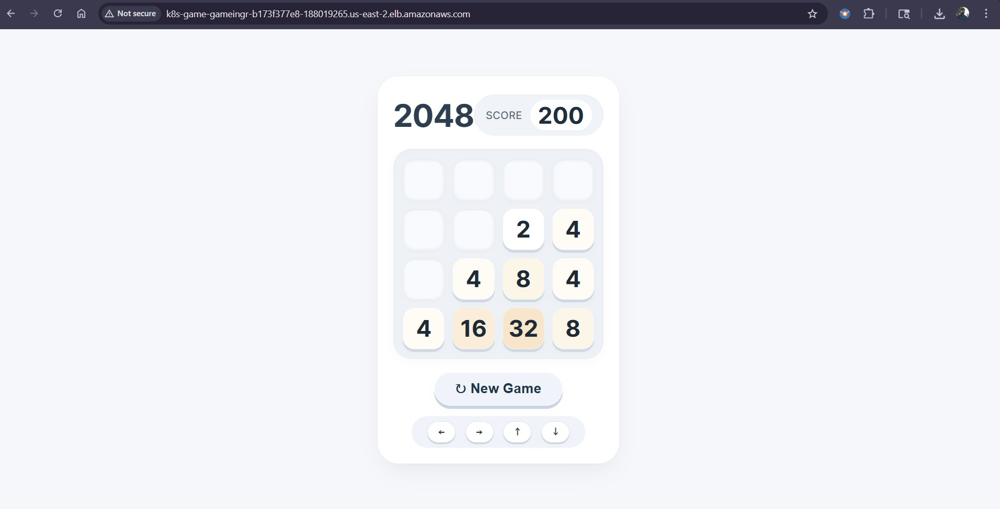
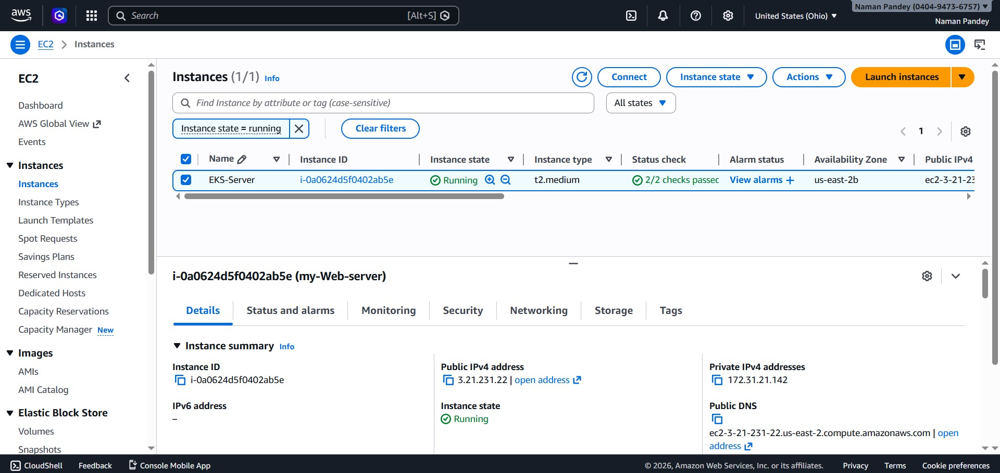

# 💬 Cloud-Native Real-Time Chat App Deployment on AWS EKS

## 📌 Project Overview

This project demonstrates a **complete cloud-native deployment** of a full-stack application using modern DevOps practices and AWS managed services.

The application is a **real-time chat app** built with **React (frontend) and Node.js + Socket.IO (backend)**, containerized with **Docker**, stored in **AWS ECR**, and deployed on **AWS EKS (Elastic Kubernetes Service)** with production-grade load balancing using **AWS ALB**.

> This started life as a 2048 game project. The app layer was swapped for a chat app; the entire DevOps pipeline (Docker → ECR → EKS → ALB Ingress) is unchanged — that's the point of the demo. This build targets **EKS only** — there's no Docker Compose / local-run path; Docker is used solely to build the images that get pushed to ECR.



## 🏗️ Architecture Diagram


## ⚙️ Workflow Diagram

```
+-----------------+      +----------------------+      +-------------------------+
|   Developer     |----->|     Docker Build     |----->|     AWS ECR             |
| (local machine) |      | (Container Images)   |      | (Image Registry)        |
+-----------------+      +----------------------+      +------------+------------+
                                                                     |
                                                                     | Pull Images
                                                                     v
+-----------------+      +----------------------+      +-------------------------+
|   AWS EKS       |<-----|   kubectl apply      |<-----|   AWS CLI/eksctl        |
| (Kubernetes)    |      | (Deploy Manifests)   |      | (Cluster Management)     |
+-----------------+      +----------------------+      +-------------------------+
         |
         | Deploy
         v
+-------------------------------------------------------------------------------+
|                         AWS Application Load Balancer (ALB)                   |
|                                   (Ingress)                                   |
+-------------------------------------------------------------------------------+
         |
         +------------------------+------------------------+
         |                        |                        |
         v                        v                        v
+-----------------+      +-----------------+      +-----------------+
| React Frontend  |      | React Frontend  |      | Node + Socket.IO |
| (Pod/Service)   |      | (Pod/Service)   |      | (Pod/Service)    |
+-----------------+      +-----------------+      +-----------------+
```

## 🛠️ Technologies Used

| Technology | Purpose |
|------------|---------|
| **React** | Frontend UI framework |
| **Node.js + Socket.IO** | Backend API + real-time messaging |
| **Docker** | Containerization |
| **AWS ECR** | Container registry |
| **AWS EKS** | Kubernetes orchestration |
| **AWS ALB** | Application load balancing |
| **kubectl** | Kubernetes CLI |
| **eksctl** | EKS cluster management |
| **Helm** | Package management |

## 💬 About the App

A single shared chat room:
- Pick a username to join.
- Messages broadcast instantly to everyone connected, via a WebSocket (Socket.IO).
- Live "online users" list and a typing indicator.
- Message history (last 100 messages) is kept **in-memory** on the server — same no-database philosophy as the original app, so nothing changes on the persistence side. History resets if the server pod restarts.

**API/Socket surface**
| Path | Type | Purpose |
|------|------|---------|
| `GET /health` | REST | Liveness check |
| `GET /api/status` | REST | Simple API status check |
| `/socket.io` | WebSocket | Real-time chat channel (join, chat-message, typing, users-list) |

## ⚠️ Scaling Note (read before bumping replicas)

The server keeps chat state (messages, online users) **in-memory in a single process**. The `chat-server` deployment is intentionally set to `replicas: 1` — with more than one replica and no shared pub/sub between pods, two users landing on different pods wouldn't see each other's messages. To scale the chat server horizontally in a real deployment, add a [Socket.IO Redis adapter](https://socket.io/docs/v4/redis-adapter/) so all pods share the same message bus. The React client (`chat-client`) is stateless and safely stays at `replicas: 2`.

## Step 1: Launch Ubuntu EC2 Instance (Build Server)

1. Go to AWS EC2 console
2. Launch a new instance
3. Select **Ubuntu 22.04 LTS**
4. Instance type: **t2.medium** (minimum for building images)
5. Create a key pair for SSH access
6. Configure security group with **SSH (22) only**



## Step 2: Install Docker

Docker is only needed here to **build the images** that get pushed to ECR — nothing is run locally with it.

```bash
# Update packages
sudo apt update -y
sudo apt upgrade -y

# Install Docker
sudo apt install docker.io -y
sudo systemctl start docker
sudo systemctl enable docker

# Add user to Docker group
sudo usermod -aG docker $USER
newgrp docker

# Verify Docker
docker --version
```

## Step 3: Install AWS CLI

```bash
# Download and install AWS CLI
curl "https://awscli.amazonaws.com/awscli-exe-linux-x86_64.zip" -o "awscliv2.zip"
unzip awscliv2.zip
sudo ./aws/install

# Verify
aws --version

# Configure AWS credentials
aws configure
# Enter: Access Key ID, Secret Access Key, Region (us-east-2), Output format (json)
```

## Step 4: Install Kubernetes Tools

**1) Install kubectl**
```bash
curl -LO "https://dl.k8s.io/release/$(curl -L -s https://dl.k8s.io/release/stable.txt)/bin/linux/amd64/kubectl"
chmod +x kubectl
sudo mv kubectl /usr/local/bin/
kubectl version --client
```

**2) Install eksctl**

```bash
curl --silent --location "https://github.com/weaveworks/eksctl/releases/latest/download/eksctl_Linux_amd64.tar.gz" | tar xz
sudo mv eksctl /usr/local/bin
eksctl version
```

**3) Install Helm**
```bash
curl https://raw.githubusercontent.com/helm/helm/main/scripts/get-helm-3 | bash
helm version
```

## Step 5: Create EKS Cluster

```bash
# Create EKS cluster (takes 15-20 minutes)
eksctl create cluster \
  --name my-chat-cluster \
  --region us-east-2 \
  --nodegroup-name workers \
  --node-type t3.medium \
  --nodes 2

# Configure kubectl to use the new cluster
aws eks update-kubeconfig --region us-east-2 --name my-chat-cluster

# Verify nodes
kubectl get nodes
```

## Step 6: Push Docker Images to ECR

**1) Create ECR Repositories**
```bash
# Create repositories
aws ecr create-repository --repository-name chat-client
aws ecr create-repository --repository-name chat-server

# Login to ECR
aws ecr get-login-password --region us-east-2 | docker login --username AWS --password-stdin <ACCOUNT_ID>.dkr.ecr.us-east-2.amazonaws.com
```

**2) Build and Push Frontend Image**
```bash
# Navigate to client directory
cd client

# Build frontend image
docker build -t chat-client .

# Tag and push
docker tag chat-client:latest <ACCOUNT_ID>.dkr.ecr.us-east-2.amazonaws.com/chat-client:latest
docker push <ACCOUNT_ID>.dkr.ecr.us-east-2.amazonaws.com/chat-client:latest
```

**3) Build and Push Backend Image**
```bash
# Navigate to server directory
cd ../server

# Build backend image
docker build -t chat-server .

# Tag and push
docker tag chat-server:latest <ACCOUNT_ID>.dkr.ecr.us-east-2.amazonaws.com/chat-server:latest
docker push <ACCOUNT_ID>.dkr.ecr.us-east-2.amazonaws.com/chat-server:latest
```

## Step 7: Configure AWS Load Balancer Controller

**1) Enable OIDC Provider**
```bash
eksctl utils associate-iam-oidc-provider \
  --region us-east-2 \
  --cluster my-chat-cluster \
  --approve
```

**2) Create IAM Policy**
```bash
# Download policy
curl -o iam_policy.json https://raw.githubusercontent.com/kubernetes-sigs/aws-load-balancer-controller/main/docs/install/iam_policy.json

# Create policy
aws iam create-policy \
  --policy-name AWSLoadBalancerControllerIAMPolicy \
  --policy-document file://iam_policy.json
```

**3) Create IAM Service Account**
```bash
eksctl create iamserviceaccount \
  --cluster my-chat-cluster \
  --namespace kube-system \
  --name aws-load-balancer-controller \
  --attach-policy-arn arn:aws:iam::<ACCOUNT_ID>:policy/AWSLoadBalancerControllerIAMPolicy \
  --approve
```

**4) Install Controller via Helm**
```bash
# Add Helm repo
helm repo add eks https://aws.github.io/eks-charts
helm repo update

# Install controller
helm install aws-load-balancer-controller eks/aws-load-balancer-controller \
  -n kube-system \
  --set clusterName=my-chat-cluster \
  --set serviceAccount.create=false \
  --set serviceAccount.name=aws-load-balancer-controller \
  --set region=us-east-2 \
  --set vpcId=<YOUR_VPC_ID>
```

## Step 8: Kubernetes Deployment Manifests

### Server Deployment (server.yml)
```yaml
apiVersion: apps/v1
kind: Deployment
metadata:
  name: chat-server
  namespace: chat-app
spec:
  # Kept at 1 — see "Scaling Note" above (in-memory chat state, no Redis adapter yet)
  replicas: 1
  selector:
    matchLabels:
      app: chat-server
  template:
    metadata:
      labels:
        app: chat-server
    spec:
      containers:
      - name: server
        image: <ACCOUNT_ID>.dkr.ecr.us-east-2.amazonaws.com/chat-server:latest
        ports:
        - containerPort: 5000
        env:
        - name: PORT
          value: "5000"
---
apiVersion: v1
kind: Service
metadata:
  name: chat-server-service
  namespace: chat-app
spec:
  selector:
    app: chat-server
  ports:
  - port: 5000
    targetPort: 5000
  type: ClusterIP
```

### Client Deployment (client.yml)
```yaml
apiVersion: apps/v1
kind: Deployment
metadata:
  name: chat-client
  namespace: chat-app
spec:
  replicas: 2
  selector:
    matchLabels:
      app: chat-client
  template:
    metadata:
      labels:
        app: chat-client
    spec:
      containers:
      - name: client
        image: <ACCOUNT_ID>.dkr.ecr.us-east-2.amazonaws.com/chat-client:latest
        ports:
        - containerPort: 80
---
apiVersion: v1
kind: Service
metadata:
  name: chat-client-service
  namespace: chat-app
spec:
  selector:
    app: chat-client
  ports:
  - port: 80
    targetPort: 80
  type: ClusterIP
```

### Ingress (ingress.yml)
```yaml
apiVersion: networking.k8s.io/v1
kind: Ingress
metadata:
  name: chat-ingress
  namespace: chat-app
  annotations:
    kubernetes.io/ingress.class: alb
    alb.ingress.kubernetes.io/scheme: internet-facing
    alb.ingress.kubernetes.io/target-type: ip
    alb.ingress.kubernetes.io/listen-ports: '[{"HTTP":80}]'
    # Socket.IO keeps a long-lived connection open — bump the idle timeout
    # so the ALB doesn't drop it after the default 60s.
    alb.ingress.kubernetes.io/load-balancer-attributes: idle_timeout.timeout_seconds=3600
spec:
  rules:
  - http:
      paths:
      - path: /
        pathType: Prefix
        backend:
          service:
            name: chat-client-service
            port:
              number: 80
      - path: /api
        pathType: Prefix
        backend:
          service:
            name: chat-server-service
            port:
              number: 5000
      - path: /socket.io
        pathType: Prefix
        backend:
          service:
            name: chat-server-service
            port:
              number: 5000
```

## Step 9: Deploy to Kubernetes

```bash
# Create namespace
kubectl create namespace chat-app

# Apply all manifests
kubectl apply -f server.yaml
kubectl apply -f client.yaml
kubectl apply -f ingress.yaml

# Check deployments
kubectl get deployments -n chat-app

# Check pods
kubectl get pods -n chat-app

# Check services
kubectl get services -n chat-app

# Check ingress (wait for ALB provisioning)
kubectl get ingress -n chat-app
```

## Step 10: Access the Application

```bash
# Get ALB DNS name
kubectl get ingress -n chat-app

# Output example:
# NAME           CLASS    HOSTS   ADDRESS                                      PORTS   AGE
# chat-ingress   <none>   *       k8s-chatapp-chatingr-xxxxxxxxxx-xxxx.elb.amazonaws.com   80      5m
```
Open in browser: `http://k8s-chatapp-chatingr-xxxxxxxxxx-xxxx.elb.amazonaws.com`

Open it in two browser tabs (or two devices) with different usernames — messages should show up on both instantly.

## ✅ Verify Deployment

```bash
# Check all resources
kubectl get all -n chat-app

# Check ingress details
kubectl describe ingress chat-ingress -n chat-app

# Check ALB logs (if needed)
kubectl logs -n kube-system deployment/aws-load-balancer-controller
```

## 🧹 AWS Cleanup (Avoid Billing 💰)

```bash
# 1. Delete EKS Cluster
eksctl delete cluster --name my-chat-cluster --region us-east-2

# 2. Delete ECR Repositories
aws ecr delete-repository --repository-name chat-client --force
aws ecr delete-repository --repository-name chat-server --force

# 3. Delete IAM Policy
aws iam delete-policy --policy-arn arn:aws:iam::<ACCOUNT_ID>:policy/AWSLoadBalancerControllerIAMPolicy
```

## 🎓 Conclusion

This project successfully demonstrates the deployment of a cloud-native real-time chat application on **AWS EKS** with production-grade architecture. By leveraging modern DevOps tools and AWS managed services, we achieved:

**Key Achievements:**

- Zero-downtime deployment using Kubernetes rolling updates.
- Automatic load distribution across multiple client pods via ALB.
- WebSocket-aware ingress routing (Socket.IO handshake + upgrade) through an ALB.
- Secure container registry with AWS ECR and IAM-based access.
- Infrastructure as Code implementation using YAML manifests.

## 🏆 Final Outcome
This project showcases expertise in containerization, Kubernetes orchestration, AWS cloud services, real-time application architecture, and production-grade deployment strategies - making it a valuable addition to any DevOps portfolio.

*Built with ❤️ by **Naman Pandey** | DevOps Engineer | Cloud-Native Architecture 🚀*
